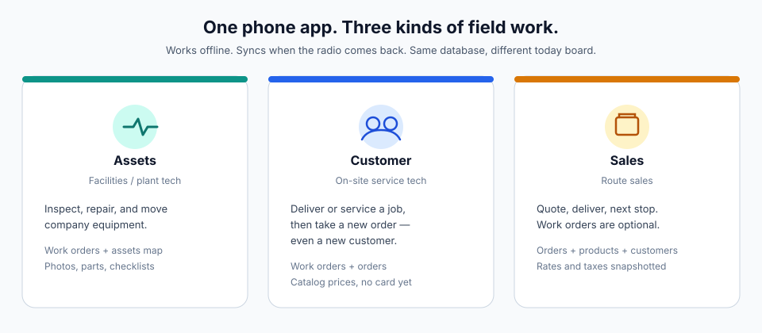
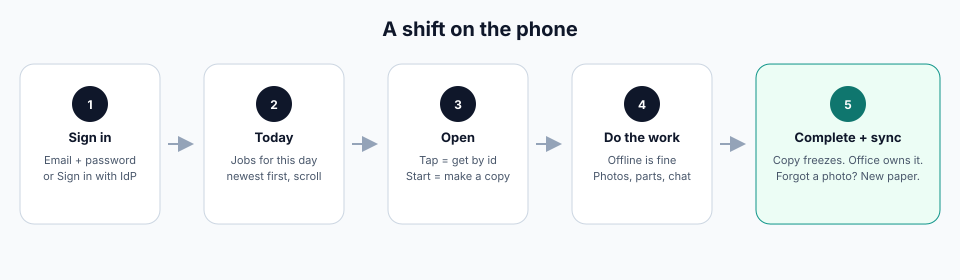
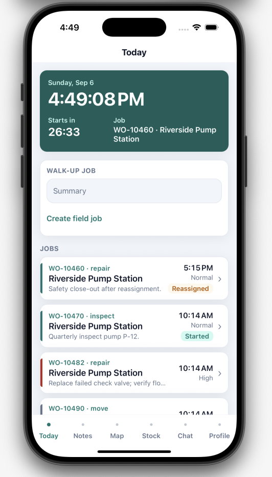
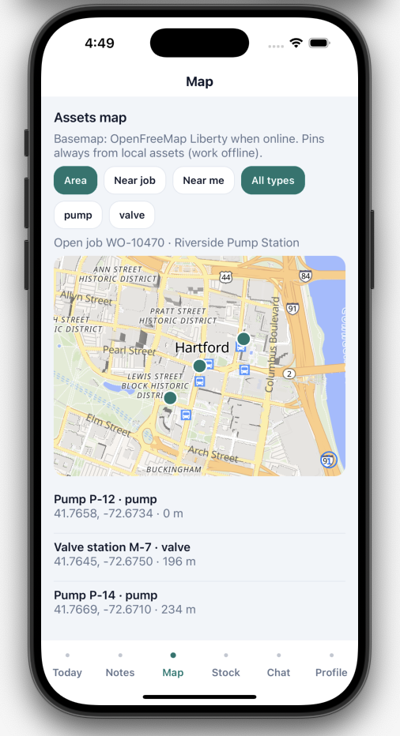
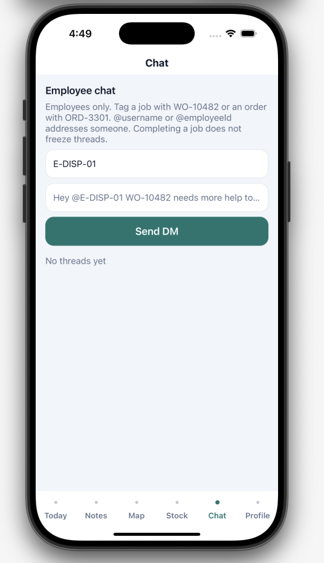
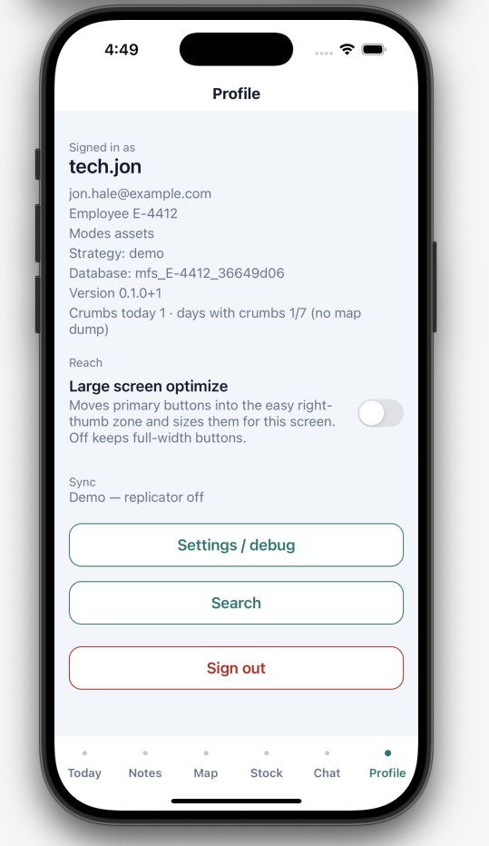
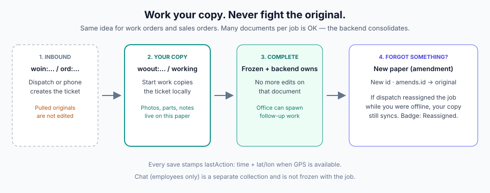
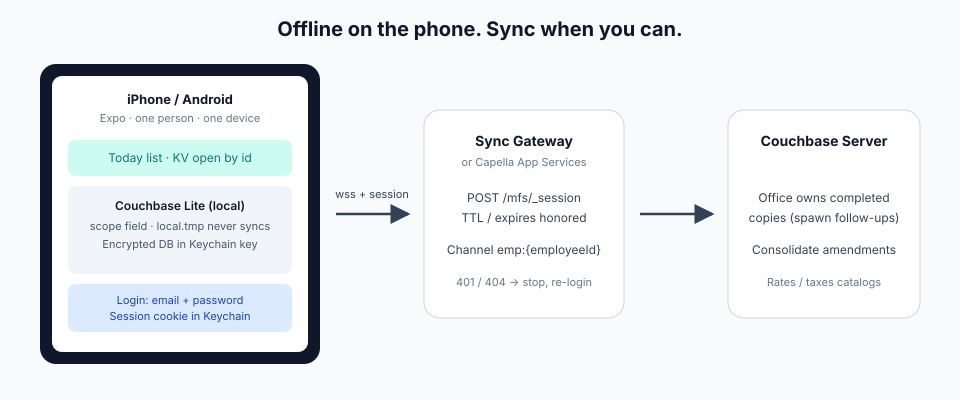

# Mobile Field Service

**Official website:** [https://mobile.fuj.io](https://mobile.fuj.io) — product story, screens, day-in-the-life, architecture, schemas.

A **phone app for people who work in the field** — inspect a pump, deliver parts, take an order on a doorstep — **even when there is no signal**.

When the radio comes back, the phone syncs with Couchbase (Sync Gateway or Capella). The office sees **your copy** of the work, not a tug-of-war on the same document.

**Status:** Expo SDK 52 + Couchbase Lite (encrypted `field.*` + replicator). Vector search is **not** on.  
**Platforms:** iOS and Android **development builds** (not Expo Go).  
**Repo:** [Fujio-Turner/mobile_field_service](https://github.com/Fujio-Turner/mobile_field_service)



---

## What you do in a shift



1. **Sign in** with work email (or Sign in with your company IdP). Demo: Jon Hale / Maya Chen / Priya Shah (or any other non-empty id as Jon).
2. **Today** shows a live clock and a seconds countdown (next start, in-progress end, late-by, or end of day), then jobs and orders for this calendar day, newest first. Scroll for more. **Right of the time** is a tiny sync HUD (green / yellow / pending count) — not a second card.
3. **Tap a row** to open it by document id. **Start work** (bottom of the inbound screen) makes **your copy**. Hermes has no `crypto`; ids use **expo-crypto**.
4. **Do the work** with no network: photos, parts, notes, employee chat, map of nearby assets. Mark operations and checklist with **outline vs filled** buttons (not a cycling row tap). Each save keeps a **history** of what changed (qty 10 → 5) with time and place. Driving around writes **tracking** crumbs for that employee and day (TTL **30 days**).
5. **Complete.** That copy **freezes** and the office owns it. Forgot a photo? You add a **new sheet of paper** that points at the original — you do not reopen the frozen one.
6. **Profile** has a one-line **sync bar**, optional **Large screen optimize** (right-thumb zone; **Left hand** when that is on), and **Settings / debug** (versions, database path, replicator, collection counts, channel filters, **job rules**). Developer catalog of every setting: [guides/SETTINGS.md](guides/SETTINGS.md).

Walk through a real day:

| If you… | Read |
| --- | --- |
| Inspect / repair / move **company** kit | [Day in the life — assets](docs/DAY_IN_LIFE_ASSETS.md) |
| Serve a **customer site**, then take another order | [Day in the life — customer](docs/DAY_IN_LIFE_CUSTOMER.md) |
| **Sell and deliver**, then the next stop | [Day in the life — sales](docs/DAY_IN_LIFE_SALES.md) |

Index of all three: [docs/DAY_IN_LIFE.md](docs/DAY_IN_LIFE.md).

---

## Screens

The tab bar is **Today · Notes · Map · Stock · Chat · Profile**. Notes and Stock are lists (general notes; van qty + catalog). The four shots below are the surfaces you live in during a shift. Demo login as Jon Hale (`workModes: assets`) hides the orders card; Maya / Priya still see orders on Today.

### Today



This is the home list. The teal header is a **live clock** plus a seconds countdown (next start, in-progress end, late-by, or end of day) and the job that countdown belongs to.

**Sync HUD** sits in that same row, immediately after the time — a dot and at most two short figures, not another card on top:

| You see | Meaning |
| --- | --- |
| **Green dot** | Connected to Sync Gateway |
| **Yellow dot** + `12m` / `2h` | Not connected; time since last successful sync |
| **Number** after the dot | Documents waiting to push |
| **Red dot** | Sync error |

Demo has no replicator, so Today shows a **yellow dot** and no elapsed/count (nothing has synced, nothing is queued). Other tabs (Notes, Map, Stock, Chat, Profile) keep a one-line bar: **Connected**, **Not connected · last synced …**, **N waiting to send**, or **Local only** in demo.

**Walk-up job** creates a field inbound ticket (`CreateWorkOrderIn`) assigned to you — still a ticket, not labor. Labor starts after **Start work** on that inbound screen.

**Jobs** are one row per work order: number · kind, site, summary, time, priority stripe. Badges: **Started** (you already have a copy), **Reassigned** (inbound went to someone else; your copy is still yours), **Amendment**. Tap is a KV get: inbound if you have not started, outbound copy if you have. Assets-mode Today does not show commercial orders; customer and sales logins do.

### Map



**Assets map** is company kit, not the route. Pins always come from local `field.assets` (bbox query), so they still show in airplane mode. The basemap (OpenFreeMap Liberty) needs network.

**Area / Near job / Near me** change the box. **All types** plus **pump** / **valve** filter the same local set. If you have a started job, the map names it (here WO-10470 at Riverside). Tap a pin or a row to open the asset; **Use on {job}** links it to your outbound copy. Completing a job does not write the asset master.

### Chat



Employee chat only — not customers. Completing a job does **not** freeze threads; messages push on send (`readyToPush`).

Type a **DM employeeId** (or `@` them in the body) and a message. Tag a job with **WO-10482** or an order with **ORD-3301**; the message stores those ids and shows a chip that opens the job or order. Job-screen chat is a separate thread (`thr:wo:{inbound id}`) that already points at that work order. Status changes (block, complete) stay on the work-order copy; chat is the conversation.

### Profile



Who you are on this device: username, email, **employeeId**, **workModes**, auth strategy, DB name, app version. **Crumbs today** is a count of tracking points (no map dump).

The **sync bar** at the top is the same status as Today’s HUD, in words (demo: **Local only**). **Large screen optimize** (off by default) moves primary buttons into the thumb zone; **Left hand** appears when that is on. **Settings / debug** is versions, DB path, replicator URL/status, collection counts, optional channel filters, **job rules**, and **DB encryption** (default off). Full list: [guides/SETTINGS.md](guides/SETTINGS.md). **Search** is FTS over notes, products, and assets. **Sign out** drops the session, not the database key.

---

## How work is designed (so we do not fight)

Dispatch — or you, on the phone — can **create** a job ticket. You **never edit a ticket the office already sent**. You copy it, work the copy, and sync that.

If they reassign the job while you are in a basement, Today shows **Reassigned**. Your copy still goes up. Two documents for one job number is expected.



---

## How the pieces fit

The phone keeps an encrypted **Couchbase Lite** database. **Sync Gateway** (or Capella App Services) talks to **Couchbase Server**. Login mints a **session with an expiry**; a fat OIDC token is exchanged for that session, not sent on every sync request.



Replication how-to (for implementers): [guides/REPLICATION.md](guides/REPLICATION.md) · official API: [cbl-reactnative.dev](https://cbl-reactnative.dev) · sample app: [expo-cbl-travel](https://github.com/couchbase-examples/expo-cbl-travel).

We use the Fujio-Turner [cbl-reactnative](https://github.com/Fujio-Turner/cbl-reactnative) fork (vector index, Couchbase Lite 4.x target), not the official 1.1 plugin as source of truth.

---

## Who this is for

| Role | Why you are here |
| --- | --- |
| **Field tech / sales** | The product: Today, jobs, orders, photos, offline. |
| **Engineer joining the repo** | Start with a day-in-the-life, then [docs/DESIGN.md](docs/DESIGN.md), then [guides/](guides/README.md). |
| **Someone wiring Sync Gateway** | Email is the SG username. Session + TTL. Example below. |

Chat is **employees only** (you ↔ dispatch), not customers. Orders **snapshot catalog prices**; we assume stock is there; **no credit card payment** in this version. Proof of delivery is a **photo** for now (signature pad is later).

---

## Run (development build)

Node **≥ 20**. Couchbase Lite is **native** — Expo Go cannot open the encrypted DB or MapLibre. `npm install` runs `scripts/fetch-cbl-native.sh` (CBL Swift + JS submodules npm does not fetch).

```bash
cp .env.example .env   # demo login, no Sync Gateway
npm install
npm test
npx expo run:ios -d "iPhone 16 Pro"
# or
npx expo run:android
```

`.env.example` sets `EXPO_PUBLIC_AUTH_STRATEGY=demo`. Sign in as Jon (`jon.hale@example.com`), Maya (`maya.chen@example.com`), or Priya (`priya.shah@example.com`); any other non-empty id is Jon. You land on **Today** with seed jobs (WO-10470 / 10482 / 10490, plus WO-10460 leftover) once the DB is open. Version on the login footer and Profile comes from `app.json`, not a hard-coded string.

Every env flag, Profile toggle, debug job rule, and Keychain key: [guides/SETTINGS.md](guides/SETTINGS.md).

Replication schema is **build-time** (`EXPO_PUBLIC_REPL_SCHEMA=simple|oneshot`), not a Profile setting. `simple` (default) keeps one continuous replicator. `oneshot` pulls `workordersin` + `orders` first, then one-shots all field collections every `EXPO_PUBLIC_REPL_ONESHOT_SEC` seconds (default 300) and when the app comes to the foreground.

**Simulator keyboard.** If a field focuses but no keyboard appears, the Mac keyboard is attached: **⌘K** (I/O → Keyboard → Toggle Software Keyboard).

**CBL SQL++ for Mobile** does not accept `IN ['a','b']` or parameterized `LIMIT $limit` / `OFFSET $offset`. Today and bbox queries use equality/`OR` and a numeric `LIMIT` baked into the SQL string.

**Map.** Asset pins always come from local `field.assets` (bbox SQL++), including airplane mode. The basemap is OpenFreeMap Liberty via MapLibre and **needs network** (or MapLibre’s last style cache). Style URL: `EXPO_PUBLIC_MAP_STYLE_URL` (default `https://tiles.openfreemap.org/styles/liberty`). MBTiles is later.

Binding: [Fujio-Turner/cbl-reactnative](https://github.com/Fujio-Turner/cbl-reactnative) (`feat/vector-search-support`). Shipping encryption + vector still needs a Couchbase Lite **Enterprise** license; lab/testing the module does not. Vector search is **not** in this train (S15).

---

## Docs map

| I want to… | Go here |
| --- | --- |
| Understand the product | [Official site](https://mobile.fuj.io) + this README + [DAY_IN_LIFE.md](docs/DAY_IN_LIFE.md) |
| See collections, queries, freeze rules | [DESIGN.md](docs/DESIGN.md) |
| See document / collection fields | [docs/schema/](docs/schema/README.md) |
| See login, Keychain, 401 handling | [AUTH.md](docs/AUTH.md) |
| See every env / Profile / debug setting | [guides/SETTINGS.md](guides/SETTINGS.md) |
| Inspect versions, DB path, replication on device | Profile → **Settings / debug** |
| See what we build in what order | [ROADMAP.md](docs/ROADMAP.md) |
| Log, style UI, cut a release, sync | [guides/](guides/README.md) |
| Agent / coding rules | [AGENT.md](AGENT.md) |
| Tests | [tests/](tests/README.md) |

---

## Sync Gateway user (example)

Login identifier is the **email**. The durable channel is `employeeId` on the profile.

```text
username:     jon.hale@example.com
password:     (set on Sync Gateway; never stored in Couchbase Lite)
session:      POST /mfs/_session  →  session_id + expires
replicator:   SessionAuthenticator(session_id, "SyncGatewaySession")

Profile (field.users)
  employeeId:   E-4412
  email:        jon.hale@example.com
  username:     tech.jon          ← audit.by only
  workModes:    ["assets"]        ← Maya Chen customer / Priya Shah sales

Channel:      emp:E-4412
```

One person, one device in this version. Lab/testing the native module does **not** require a Couchbase Lite Enterprise license; shipping encryption + vector still does.

---

## License

[Apache License 2.0](LICENSE)
