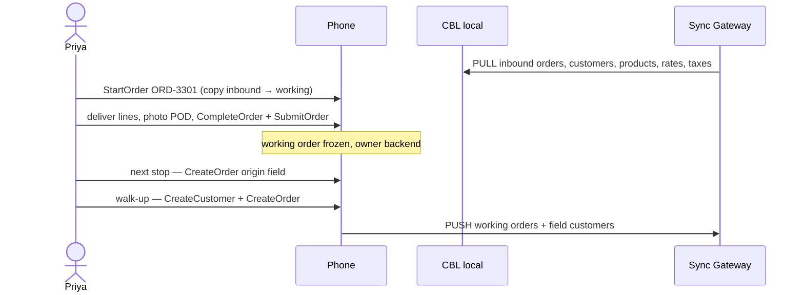

# Day in the life — sales route

| Field | Value |
| --- | --- |
| Title | Order, deliver, next stop |
| Mode | `sales` |
| Repo | [Fujio-Turner/mobile_field_service](https://github.com/Fujio-Turner/mobile_field_service) |
| Author | Fujio-Turner / mobile_field_service |
| Date | 2026-09-04 |
| Status | Draft |
| Index | [DAY_IN_LIFE.md](./DAY_IN_LIFE.md) |
| Orders schema | [SCHEMA_ORDERS.md](./SCHEMA_ORDERS.md) |
| Rates / taxes | [SCHEMA_RATES.md](./SCHEMA_RATES.md), [SCHEMA_TAXES.md](./SCHEMA_TAXES.md) |

Collections in play: `orders`, `products`, `customers`, `rates`, `taxes`, `inventory`, `messages`.  
Work orders are **optional** here. Pure sales is: quote/order → deliver product or service → freeze the order → next customer. **No credit card.** Catalog prices are **snapshotted**; assume stock is available. POD is a **photo**; signature pad is later. If she needs a labor ticket, she `CreateWorkOrderIn` on the phone.

---

## Persona

| | |
| --- | --- |
| Name | Priya Shah |
| Role | Route sales |
| `employeeId` | `E-8801` |
| Email | `priya.shah@example.com` |
| `workModes` | `["sales"]` |
| Day | Friday 4 September 2026 |

Channel `emp:E-8801`. Today’s board is **orders** assigned to her (`role: inbound` pull, or her own `role: working` drafts). Same copy-on-write: she never mutates a pulled order; she copies to `role: working` (`StartOrder`) or creates `origin: field`.

---

## Screen map

| When | Route | Collection(s) | Operation(s) |
| --- | --- | --- | --- |
| Today | `app/(tabs)/index.tsx` (orders) | `orders` | `ListTodayOrders` |
| Order | `app/order/in/[id]` / `app/order/[id]` | KV | `GetOrder`, `StartOrder` |
| Catalog | products search | `products`, `rates`, `taxes` | `AddOrderLine`, `PriceLines` |
| Customer | `app/customer/[id]` | `customers` | `GetCustomer`, `CreateCustomer` |
| Deliver | same order editor | blobs + inventory | `CommitPhoto`, `ConsumeInventoryOnWork` (order-scoped) |

---

## Timeline

### 08:00 — Assigned order (ORD-3301)

Today lists inbound orders for `emp:E-8801`, `scheduled.day` today, `ORDER BY scheduled.startDt DESC LIMIT 20 OFFSET n`. Tap is KV. **Start order** copies inbound JSON to a new `ord:<ulid>` with `role: working`, `source.id` = inbound id. Inbound never written.

She delivers the catalog lines already on the snapshot, adjusts qty only on **her** copy, stamps `lastAction`, photo POD. `CompleteOrder` freezes the working copy (`owner: backend`). `SubmitOrder` sets `ready_to_push`. Backend invoices from **that** document.

### 10:00 — Next stop, sell on the doorstep

No inbound order. `CreateOrder` `origin: field`, pick existing customer, add lines (product + service hour). `PriceLines` applies current `rates` + `taxes` and **snapshots** amounts onto the lines. Customer signs / she completes + submits. Next.

### 11:30 — New logo, new customer

Walk-up. `CreateCustomer` (`origin: field`) then `CreateOrder`. She does not patch some other company’s customer doc.

### 13:00 — Forgot a SKU after complete

Frozen. **Add follow-up** → amendment `ord:` with `amends.id`. Backend consolidates. Same “second sheet of paper” as work orders.

### 13:15 — Dispatch reassigned ORD-3290 while she was offline

Today badge **Reassigned**. Her working copy still submits. The new assignee may `StartOrder` their own working copy. Multiple `ord:` docs, one order number, eventual consistency.

---

## Rules this day proves

1. Sales can run **without** workorders. Delivery proof lives on the **order**.
2. Inbound orders are pull-only; working copies are what push.
3. Rates and taxes are catalogs; money on the order is a **snapshot**.
4. Freeze, amendment, reassignment, `lastAction` — same as WOs.
5. Next stop = new document or a new StartOrder, never reopen frozen.

## Beat sheet

1. Login Priya, `workModes: ["sales"]`, Today is orders not WOs.
2. StartOrder copy; inbound JSON unchanged.
3. Deliver + POD + CompleteOrder + SubmitOrder.
4. Field `CreateOrder` priced from rates/taxes.
5. `CreateCustomer` + order.
6. Amendment after freeze.
7. Reassigned inbound still shows her working copy.
